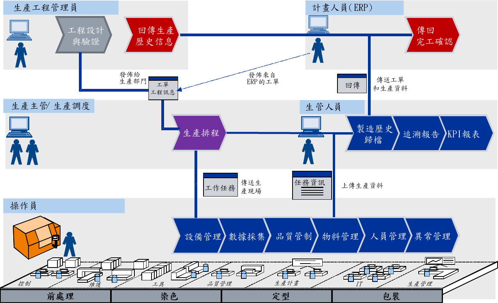
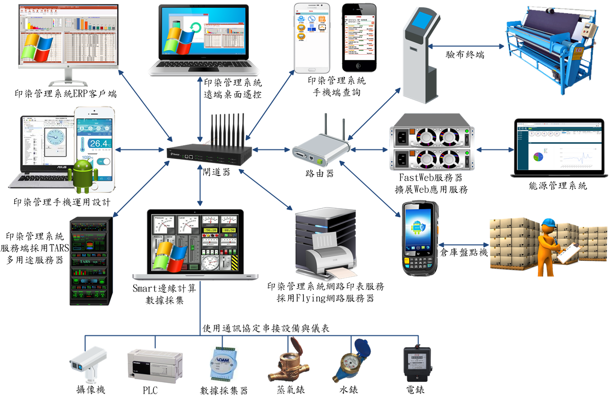
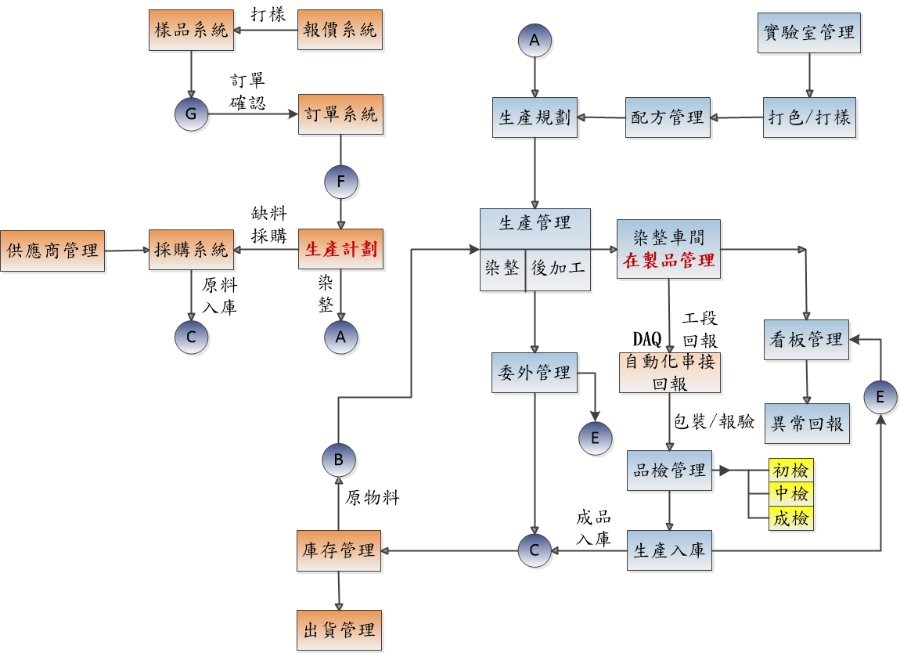
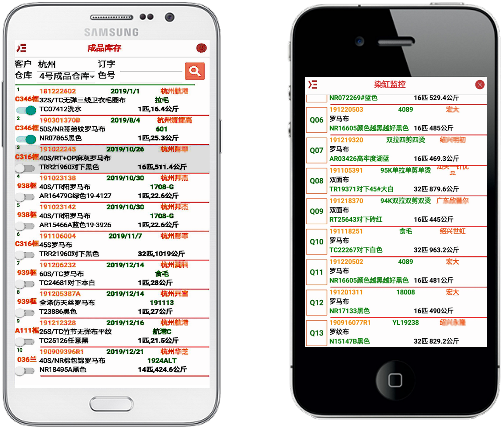
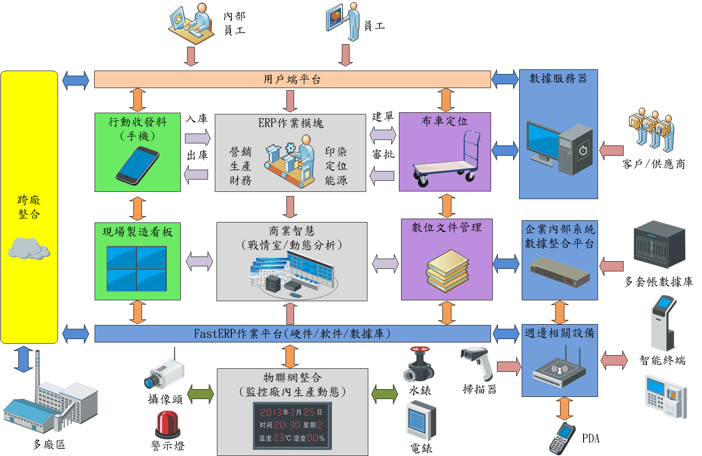

# FastERP1
採用FastERP-1開發，專用印染、紡織業。管理印染廠銷售業務部、工藝技術部、計畫部、生產部、倉儲部、財務部等多個部門。

> **加入 Facebook 社團**
>
> [https://www.facebook.com/groups/isoface/](https://www.facebook.com/groups/isoface/)
> 
> **點讚追蹤 Facebook 粉絲專頁**
> 
> [https://www.facebook.com/AIOT.ERP](https://www.facebook.com/AIOT.ERP)

因應染整紡織廠的智慧化與自動化的工業4.0時代來臨，落實建構智慧工廠，印染企業能透過ERP 管理系統輕鬆管理生產機台、布車、現場人力運作情形，將資訊系統的功能及效益最大化。隨著企業快速發展，市場競爭日益激烈，企業內部的精細化、規範化、資訊化管理的需求日趨強烈，整合企業資源，提升企業的核心競爭力，構建適應和促進企業發展需要的資訊化管理系統已經迫在眉睫。企業內資訊流、資金流、物流資源的整合、加強對關鍵業務控制力度以快速回應外部市場的變化，都需要借助最先進的技術和管理理念，並進行整體的部署和規劃，來建設一個能夠及時、準確、全面地反映企業經營資訊，實現事前預警、事中控制、事後分析評價，由結果控制轉變為過程監控；具有功能強大的分析、查詢體系，充分適應企業發展需要的完整的資訊化管理平臺，實現發展目標，全面提升企業的核心競爭力。

愛招飛開發ERP印染業管理平臺，專為針織面料生產企業所研發。整個系統涉及針織面料生產企業的銷售業務部、工藝技術部、計畫部、生產部、倉儲部、財務部等多個部門。主要功能包括：從銷售接單到工藝的分析；從染紗工藝、織造工藝、整理工藝的制定再到計畫的下發；從排染紗計畫，織機派工再到後整理生產各工序的投入產出核算；從原料的採購再到原料的入出庫跟蹤；從坯布，成品的檢驗到坯布、成品布的收、發貨；從財務的應收應付到成本核算等。可説明針織面料生產企業實現管理的規範，效率的提升，並最終提供及時準確的生產資料説明企業的管理層進行決策支援。

## 系統架構特色

* 使用愛招飛軟體開發工具研發設計，客戶端採用 FastERP，服務端採用 TARS，手機端採用 PinToo，並利用 FastWeb 擴展其它 Web應用。
* 採用愛招飛軟體工具 TaskRuner，監管所有印染管理系統相關應用程序運行狀況。如遇突發狀況，立即發送警訊通知管理人員。自訂處理程序，例如關閉運行程序、重啟..，自動解決繁雜的意外狀況。
* 操作問題，使用愛招飛軟體工具FastDesk，通知管理人員進行遠端桌面遙控，快速解決疑惑。
* 使用愛招飛軟體工具 Flying，協助印染管理系統，無論在客戶端、手機端、或者FastWeb所擴展的Web應用程序，都可使用便捷的網路印表服務。
* 紡織印染廠的動力需求包括水、電、水蒸氣..，複雜的儀表數據採集與能源管控，使用愛招飛控商務軟體【能源管理】，與印染管理系統整合，進行各種多元的統計分析與成本運算，是企業主經營判斷的重要依據。
* 無縫銜接印染廠多種終端設備，包括自助出庫終端、驗布終端、庫存盤點機..，與印染業管理系統數據整合。
* 整合網路攝影機，監控印染廠、辦公室，確保人員與設備的安全。
* 車輛與業務人員外出，利用手機定位，隨時掌控人車位置，定期提供統計分析表，管理無縫隙。
* 印染廠其它任何產業需求，採用愛招飛軟體開發工具進行擴展，例如Smart進行邊緣計算，數據採集，人工智慧整合..，PinToo快速設計手機APP，FastWeb擴展各種Web應用程序。

## 產業運用特色

* 訂單跟蹤，在生產訂單下發後，可在訂單執行情況表模組中查詢訂單的進度情況，及時瞭解訂單進度，方便預估訂單完成時間。
* 工單跟蹤，在工單下發後，可在工單執行情況表模組中查詢工單進度，可配合制程刷卡終端瞭解工單的流轉情況。
* 批號跟蹤，可用於跟蹤該批次的坯布生產情況。及時瞭解白坯結存資訊。
* 工單成本分析，根據資訊採集的資料進行分類匯總，可分析得到分攤到每一個工單上的成本資訊，快速掌握盈利點。
* 車間在製品積壓情況分析，根據生產計畫的派發以及制程刷卡的操作，可以分析得到處在各待產工序中的產量資訊，便於生產計畫部門及時調整生產計畫，保障生產進行合理有序。
* 可根據客戶需求定制相關報表，客戶如有對特定內容的分析報表的需求，可進行現場定制，快速實現。
* 微信公眾號，可將平臺與微信公眾號進行對接，當生產流程中出現異常時可及時向相關人員進行消息推送，及時掌握生產動態。
* 郵件推送，可將平臺與電子郵箱進行對接，可向相關人員推送報表以及異常提示的相關資訊。
* 智慧手機、平板APP，在APP上提供一些簡單報表的資訊，便於出差在外時及時瞭解車間的生產資訊。

## FasERP印染管理系統

1. 系統管理

    * 基礎資料管理，包括客商、物料、部門員工等基礎資料的資料管理。
    * 生產資料管理，包括工序、工藝路線、設備、疵點等生產資料管理。
    * 系統設置，包括系統參數、會計期間、單據號編碼規則及公用檔管理。
    * 操作員及許可權管理，包括操作員定義、角色定義以及許可權定義管理。

2. 銷售管理

    * 銷售報價，可針對客戶、色號及特殊工藝報價，建立標準報價體系，在系統內進行報價核價；自動檢索歷史報價，為最新報價提供歷史依據。
    * 銷售訂單，根據銷售報價制定銷售訂單。
    * 銷售訂單執行情況，可在該報表中查詢銷售訂單的流轉情況。
    * 發貨通知單、銷售發票、銷售對帳單、銷售排名分析

3. 坯布管理

    * 白坯布庫存管理，包含白坯出入庫業務類型，白坯入庫管理，白坯出庫管理，白坯調撥管理，白坯碼單拆分，批號跟蹤管理，通過出入庫單據生成庫存報表，進行庫存資料統計。
    * 成品布庫存管理，包含成品出入庫業務類型，成品入庫管理，成品出庫管理，成品調撥管理，成品碼單拆分，批次和成品碼單的跟蹤管理。
    * 坯布結轉
    * 坯布庫齡管理，用於坯布庫存超期收費的管理。\

4. 化工料管理

    * 化工料進倉管理，進倉時登記化工料單價資訊作為成本核算的依據。
    * 化工料領用管理，與料單用量對比分析耗用情況。
    * 化工料調撥管理
    * 安全庫存量、超儲及過期報警處理
    * 倉庫盤點管理，可快速進行倉庫盤點操作，及時更新倉庫庫存。
    * 倉庫結轉
    * 化工料倉庫管理的決策報表

5. 配方管理

    * 對樣間管理，包含染色配料單，染色補料單，定型助劑單等，可通過針對生產領料的決策報表及用料成本報表對非正常領料進行分析。

6. 機物料庫存管理

    * 機物料進倉管理，進倉時進行單價登記以作為成本核算的依據。
    * 機物料領用管理
    * 機物料庫存量、超儲及過期報警處理
    * 機物料倉庫盤點管理
    * 機物料倉庫結轉，可快速進行倉庫盤點操作，及時更新倉庫庫存。
    * 機物料倉庫管理的決策報表

7. 打樣管理

    * 打樣管理包括打樣通知單，打樣記錄單，樣品確認，樣品檔案，樣品搜索，樣品成本計算，寄樣管理等。
    * 複樣管理包括處方調整等，最終用於生成染色配方。

8. 工藝管理

    * 配方管理包括標準配方，生產處方，處方成本管理，生產處方成本計算。
    * 工藝資料管理包括拉毛工藝單，預定工藝單，成定工藝單。
    * 工藝管理相關報表
  

9. 生產管理

    * 生產計畫管理，包含生產訂單，生產訂單變更。
    * 生產開卡管理，包括根據白坯庫存自動開卡，根據白坯庫存及生產訂單開卡。
    * 生產計畫跟蹤管理，用於跟蹤生產訂單的執行情況。
    * 設備計畫（針對染缸、定型機等排計畫）。
    * 工單拆分管理、工單回修管理、工單變更管理
    * 異常報告單，包含品質事故報告，品質回修報告。
    * 提供生產計畫、開卡過程中的決策報表

10. 成品碼單管理

    * 成品碼單管理，包括列印成品標籤，列印成品碼單以及自動產生成品入庫單。

11. 存貨核算管理

    * 月結處理，計算領用成本
    * 月末暫估處理
    * 生成收發存月報及物料收發台帳
    * 出庫單領用單價計算（加權平均價、移動平均價等價格計算方式）

12. 財務管理

    * 應收款管理包含預收款，收款單和其它應收款。
    * 應付款管理包含預付款，付款單和其它應付款。

## 物聯網整合印染管理系統

透過物聯網，達到自動化與人機整合，自動收集生產線上的「人、機、料、法、環」等重要資訊反饋給ERP系統，將資訊系統的功能及效益最大化；管理者能透過電腦系統、電子看板等媒介，輕鬆管理生產機台、製造流程、現場人力運作情形，達成生產現場的效率、良率、量產管理e化的目的。做到物聯網整合、車間自動化、人機整合、SCADA資料的收集；然後運用物聯網系統將資料整合串連；使用ERP進行BI企業決策。

布局行動化與雲端化，邁進工業4.0

染整廠採用專案規劃可以節省人力成本，挾著垂直整合一貫廠的優勢，朝工業4.0方向邁進，持續引進新的系統及技術，加強行動化與雲端化布局。

為更加充分的利用所採集的報工資料，實現生產過程和生產管理資訊的整合，需要實現採集即時資料庫和關聯式ERP資料庫中的資料整合。把即時資料庫中經過運算、匯總資料輸出到關聯式資料庫中，從而實現與管理資料庫的集成，為企業的上層管理提供可靠的資料基礎。

積極回應國家節能減排政策，基於FastERP即時資料庫平臺，構建廠級生產過程的即時資訊監控和調度，為企業管理層提供真實、可靠的即時運行資料，為市場運作下的企業提供科學、準確的經濟性指標。從管理角度來看，它為控制企業成本、為提高生產力提供重要而真實的運行資料；同時，通過資料的分析和比較，能提出科學的、合理的決策方案，使企業管理層的經營決策更具科學性，實現企業的可持續發展。